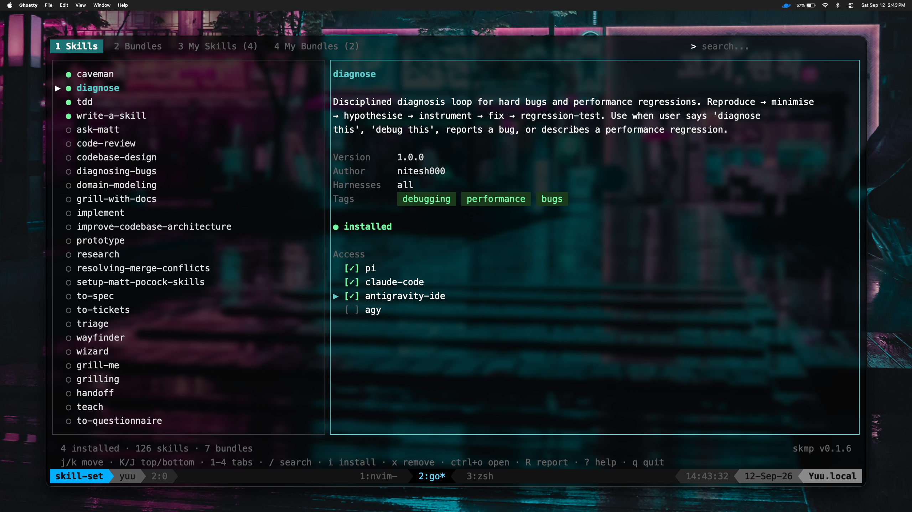
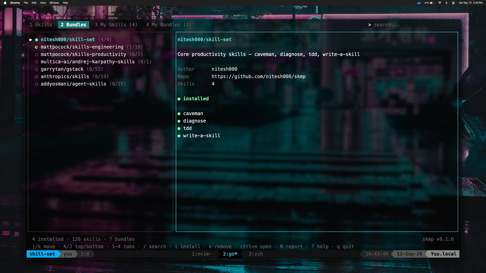
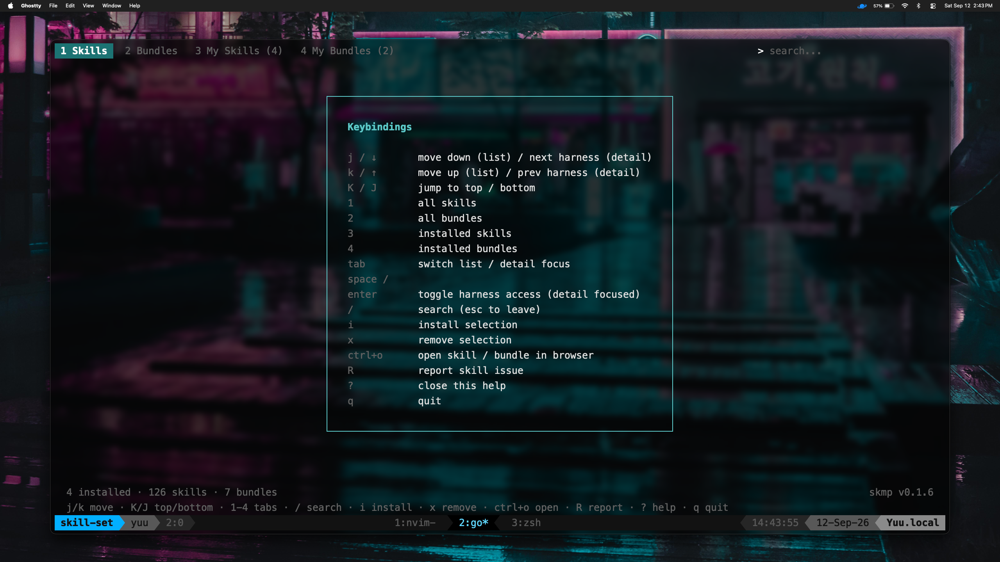

# skmp

A full-screen TUI package manager for AI agent skills.

Install, search, and manage skills across all major agentic tools — pi, Claude Code, Antigravity, Codex, Cursor, and OpenCode — from one place.



<details>
<summary><b>View more screenshots</b></summary>
<br>

**Bundles Tab:**


**Help Menu:**

</details>

> **Demo** — [watch a 60-second walkthrough](https://res.cloudinary.com/doqtqybtr/video/upload/v1789204940/Screen_Recording_2026-09-12_at_2.49.11_PM_ls2fvy.mov)

---

## Install

```bash
npm install -g skmp-cli
```

Or grab a binary from [Releases](https://github.com/Nitesh000/skmp/releases):

```bash
# macOS / Linux — pick the right asset from the release page
curl -L https://github.com/Nitesh000/skmp/releases/latest/download/skmp_$(uname -s)_$(uname -m).tar.gz | tar xz
sudo mv skmp /usr/local/bin/
```

```bash
# Homebrew (macOS / Linux)
brew tap Nitesh000/tap
brew install skmp
```

---

## Usage

### TUI (recommended)

```bash
skmp
```

Opens the full-screen interface. Browse skills, read descriptions, and install or remove with a single keypress.

### CLI

```bash
# install skills
skmp add caveman
skmp add caveman diagnose tdd          # multiple at once
skmp add --bundle nitesh000/skill-set      # install a whole bundle

# remove skills
skmp remove caveman
skmp remove caveman diagnose

# list installed skills
skmp list

# re-link skills into a newly installed harness
skmp sync

# update the local registry cache
skmp update
```

---

## Keybindings

| Key               | Action                                            |
| ----------------- | ------------------------------------------------- |
| `j` / `↓`         | move down (list) / next harness (detail)          |
| `k` / `↑`         | move up (list) / prev harness (detail)            |
| `K` / `home`      | move to top                                       |
| `J` / `end`       | move to bottom                                    |
| `1`               | Skills tab                                        |
| `2`               | Bundles tab                                       |
| `3`               | My Skills tab                                     |
| `4`               | My Bundles tab                                    |
| `/`               | search                                            |
| `esc`             | clear search                                      |
| `tab`             | toggle focus between list and detail pane         |
| `space` / `enter` | toggle harness access (when detail focused)       |
| `i`               | install selected                                  |
| `x`               | remove selected                                   |
| `ctrl+o`          | open skill / bundle in browser                    |
| `R`               | report skill issue (opens prefilled GitHub issue) |
| `?`               | toggle help                                       |
| `q`               | quit                                              |

Mouse is fully supported: scroll to navigate, click tabs to switch, click list items to select, click harness rows in the detail pane to toggle access.

---

## Supported Harnesses

| Harness                                    | Skills path                         | Mechanism |
| ------------------------------------------ | ----------------------------------- | --------- |
| [pi](https://github.com/earendil-works/pi) | `~/.agents/skills/`                 | symlink   |
| [Claude Code](https://claude.ai/code)      | `~/.claude/skills/`                 | symlink   |
| [Antigravity IDE](https://antigravity.ai)  | `~/.gemini/antigravity-ide/skills/` | symlink   |
| [agy](https://antigravity.ai)              | `~/.gemini/config/skills/`          | symlink   |
| [Codex](https://github.com/openai/codex)   | `~/.codex/skills/`                  | symlink   |
| [Cursor](https://cursor.com)               | `~/.cursor/skills-cursor/`          | symlink   |
| [OpenCode](https://opencode.ai)            | registered in `opencode.jsonc`      | config    |

Skills are downloaded once to `~/.skmp/skills/` and symlinked into every detected harness automatically. Run `skmp sync` after installing a new harness to wire up existing skills.

OpenCode is the exception — it reads skills from paths listed in its own config, so skmp registers `~/.skmp/skills` under `skills.paths` in `~/.config/opencode/opencode.jsonc` instead of symlinking.

To control which harnesses have access to a specific skill, open the TUI, select the skill, press `tab` to focus the detail pane, then use `j`/`k` + `space` to toggle individual harnesses. Mouse click on harness rows works too.

---

## Registry

The skill registry lives at [`registry/index.json`](registry/index.json) in this repo and is served directly from GitHub. It is cached locally for 24 hours (`skmp update` forces a refresh).

Skills themselves live in their **author's own GitHub repo** — the registry only stores metadata and a source URL. skmp fetches skill files on demand at install time.

### Submitting a skill

1. Create a GitHub repo with at least a `SKILL.md` (see [skill format](#skill-format))
2. Open a PR adding your skill to `registry/index.json`
3. That's it — you host the files, the registry just indexes them

### Submitting a bundle

A bundle is a named collection of skills from one repo. Add a `bundles` entry to `registry/index.json`:

```json
{
  "name": "yourname/bundle-name",
  "description": "What this bundle does",
  "author": "yourname",
  "repo": "https://github.com/yourname/your-repo",
  "branch": "main",
  "skills_path": "skills",
  "skills": ["skill-one", "skill-two"]
}
```

---

## Skill Format

Every skill needs at minimum a `SKILL.md`:

```markdown
---
name: your-skill
description: One line description of what the skill does.
---

Instructions for the AI agent go here.
```

Optional files: `REFERENCE.md`, `EXAMPLES.md`

---

## How It Works

```
registry/index.json                    — metadata + source URLs (CDN-served)
~/.skmp/skills/                        — downloaded skill files (skmp owns this)
~/.agents/skills/                      — symlinks → ~/.skmp/skills/  (pi)
~/.claude/skills/                      — symlinks → ~/.skmp/skills/  (Claude Code)
~/.gemini/antigravity-ide/skills/      — symlinks → ~/.skmp/skills/  (Antigravity IDE)
~/.gemini/config/skills/               — symlinks → ~/.skmp/skills/  (agy)
~/.codex/skills/                       — symlinks → ~/.skmp/skills/  (Codex)
~/.cursor/skills-cursor/               — symlinks → ~/.skmp/skills/  (Cursor)
~/.config/opencode/opencode.jsonc      — skills.paths entry (OpenCode)
```

---

## Contributing

See [CONTRIBUTING.md](CONTRIBUTING.md).

## License

MIT — see [LICENSE](LICENSE).
